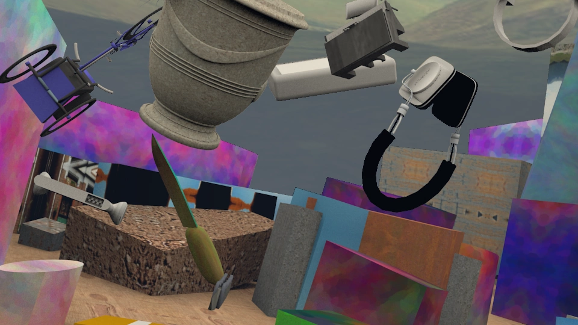

# Reproducing-PSMNet

## Introduction

## Pyramid network

<figure>
<figcaption aria-hidden="true">Architecture overview of the proposed PSMNet.</figcaption>
</figure>

### Difference between ResNet and PSMNet

## Pretrained model

  
               Results using pre-trained models
|            |  Model  | SceneFlow | Kitti 2015 | Kitti 2012 |
|:-----------|:--------|:---------:|:----------:|:----------:|
| Batch size | Workers |    EPE    |    EPE     |    EPE     |
|            |         |           |            |            |
|            |         |           |            |            |
|            |         |           |            |            |
|            |         |           |            |            |

### Sceneflow Performance

## Using Steve's Dataset

### Prism stereo image

### Results

## Description of the paper
The paper can be found [here](https://arxiv.org/abs/1803.08669).  
GitHub repository of the code used in this paper can be found [here](https://github.com/JiaRenChang/PSMNet).

<figure>
<figcaption aria-hidden="true">Schematic representation of the Low Turbulence Tunnel.</figcaption>>
</figure>

