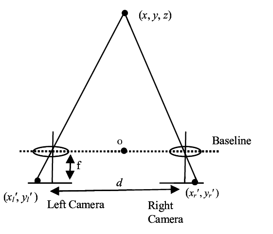
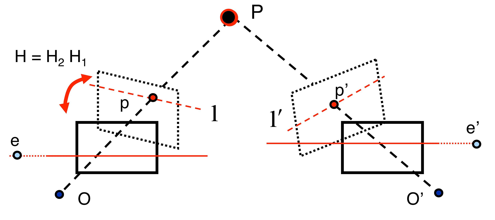
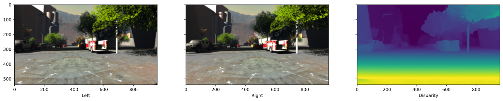
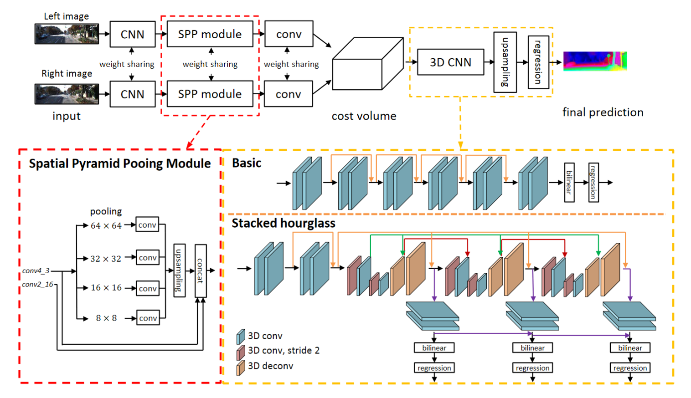
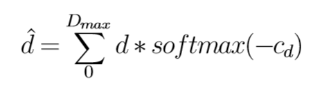
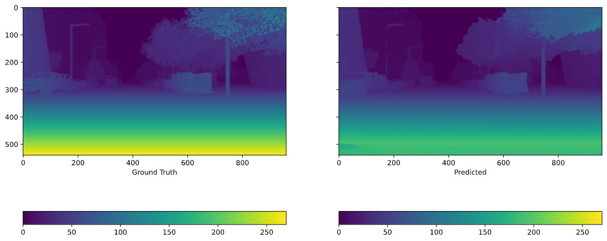
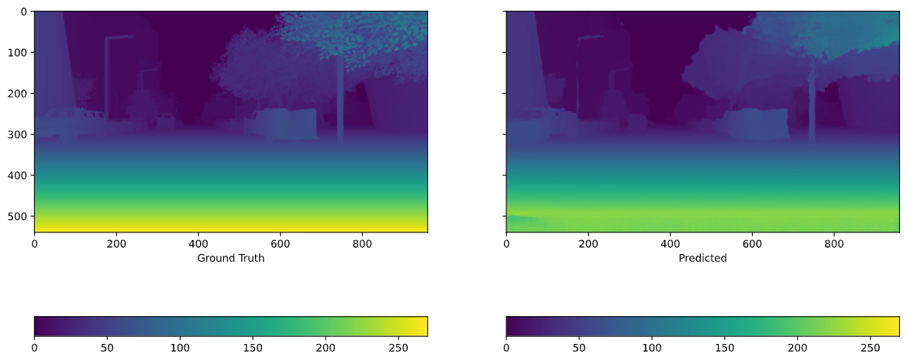
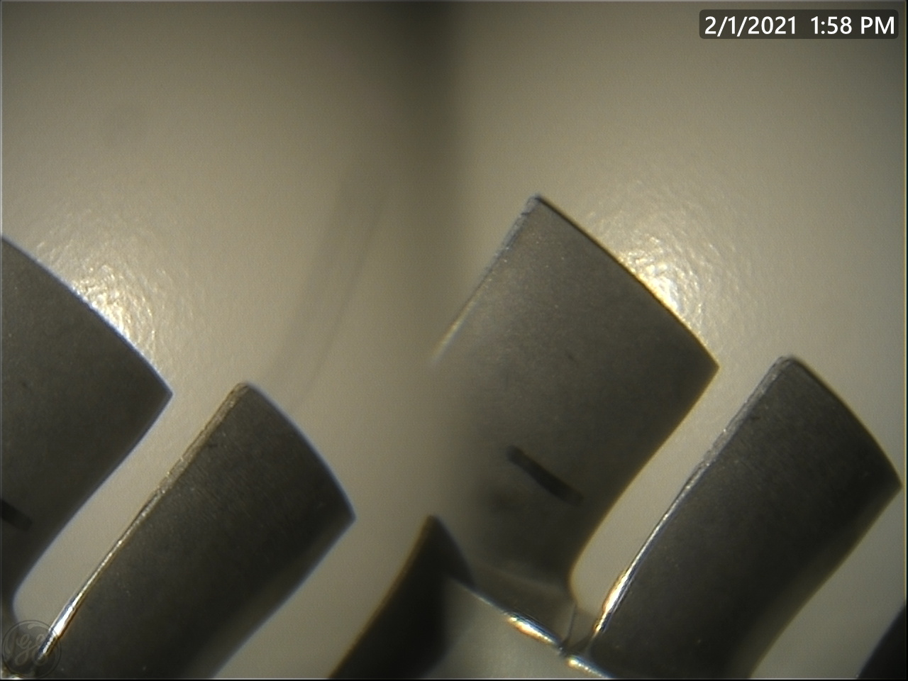
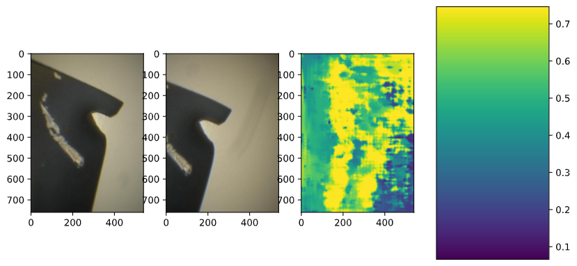
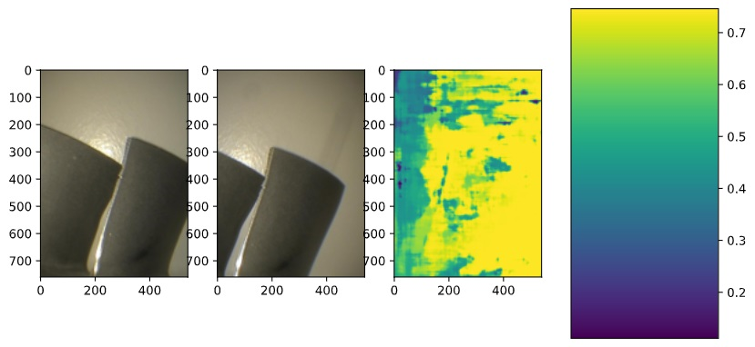

# Introduction to disparity maps

PSMNet is a Stereo Matching Network published by [Jia-Ren Chang and Yong-Sheng Che](https://arxiv.org/abs/1803.08669) in 2018. The goal
of stereo matching is to find the disparity map of a left and right
image. Disparity is in direct relation to depth through the focal
distance and baseline of the two lenses used. The depth is equal to
focallength\*baseline/disparity so a high disparity means that the
object is close to the camera’s and low disparity means it is far away.

<figure>
<figcaption aria-hidden="true">Disparity to depth</figcaption>
</figure>

This equation does assume that the images are rectified, meaning the
camera’s are exactly parallel to each other, not rotated inwards or
outwards. Normal stereo camera setups do have this parallelism, but some
camera arrays need a prepossessing step rectifying the images to a
common plane.

<figure>
<figcaption aria-hidden="true">Image rectification</figcaption>
</figure>

An example of a disparity map is given below. Deep learning networks
have been used for a while to learn disparity maps from stereo images
and today we are going to discuss reproducing PSMNet, a high performing
Pyramid network on both Sceneflow and KITTI 2012/2015 stereo data-sets.

<figure>
<figcaption>Disparity map created by PSMNet. Images are from the sceneflow dataset.</figcaption>
</figure>

# Pyramid network

<figure>
<figcaption aria-hidden="true">Architecture of PSMNet</figcaption>
</figure>

PSMNet consists of two main parts, the pyramid structured feature
extractor and a 3D CNN. The pyramid feature extractor tries to find a
different sized features through different pooling sizes (8x8, 16x16,
32x32, 64x64). These pooled features are led through convolutions where
after they are up-sampled to the same HxW dimensions again. Both image’s
features are combined into a 4D cost volume for each disparity level
(Height x Width x Features x Disparity). The 3D CNN consists out of a multiple
stackhourglass type 3D convolutions with residual connections. The final
disparity is calculated using regression with the following formula
, where *D**max* is the maximum
disparity the model can predict, *c**d* the predicted cost
for that disparity. This method is supposed to be more robust than
classification .

<figure>

</figure>

For training purposes intermediate supervision was used with the same
regression predicted disparity, but earlier in the 3D CNN. The training
cost was calculated as a combination of the final cost and the two
intermediate costs.

 
# Pretrained model

In this section we are trying to reproduce the results in the paper
using the pretrained models downloaded from the [PSMNet Github][]. Due
to resource constraints we could not replicate the situation in which
the author of PSMNet tested its model on Sceneflow or KITTI 2012/2015.
At first we had to switch back to batchsize 1 and 1 worker instead of
the batchsize 12 and 4 workers used for training these models. The End
Point Error (EPE) calculated by us was 4 times higher than in the paper
for the sceneflow test data-set. We found similar errors using the KITTI
2012/2015 pretrained. A hypothesis was drawn that this could be because
of a different batchsize.

In the next experminents we tried to acquire more resources to train
with a higher batchsize. We tried to use Google Cloud, but were not
allowed to allocate multiple GPU’s (The paper used 4 GPU’s; Actually we
did not manage to allocate a single GPU on Google Cloud). We settled
with Google Colab were it was possible possible to train with a
batchsize of 4.

The results of these experiments are plotted below in table [1][]. There
was modest decrease in EPE while training with a higher batchsize. The
EPE is still far away from the 1.19 advertised in the paper and the
batchsize jump from 4 to 12 is not going to bridge that gap.

| Model      |         |      SceneFlow       | Kitti 2015 | Kitti 2012 |
|:-----------|:--------|:--------------------:|:----------:|:----------:|
| Batch size | workers | EPE (End-Point-Error |            |            |
| 1          | 1       |        5.738         |   5.638    |   5.520    |
| 3          | 2       |        5.721         |   5.612    |   5.502    |
| 4          | 2       |        5.701         |     \-     |   5.464    |

Results using pre-trained models

After this disappointment we dove into the code to find any mistakes.
Little did we know there were other reprodrucer that had the same
problem.

## 1.17 factor

We found one of the culprits that had to do with deprecated function
function upsample(). Adding the variable align\_corners=True to those
functions in the original script increased performance, but still it was
far from the paper’s performance.

A second issue that some researchers had trying to use the pre-trained
was an overall decrease in output disparity. As described in this
[Github Issue][] multiplying the output disparity by a factor 1.17
decreased the EPE by a significant margin. In our case this worked as
well and we managed to produce an EPE of 1.52 compared to the 1.19 in
the paper. This 1.17 factor was supposed to only work for the Sceneflow
pre-trained model and we found out that was true in our case as well,
because 1.17 factor did not decrease EPE with the KITTI 2012 pre-trained
model. The cause of this factor is unknown to us, researchers on the
Github page say that by training the model themselves they could not reproduce this error and found the papers original
EPE error of 1.19.

|               Fixes               |                      |                        |
|:---------------------------------:|:--------------------:|:----------------------:|
|                                   | Pretrained Sceneflow | Pretrained KITTI\_2012 |
|        align\_corners=True        |        6.463         |         4.730          |
| align\_corners=True & 1.17 factor |        1.585         |         4.961          |

Results using the fixes for the pre-trained models on Flying3d test
data-set (EPE)

A comparison of the disparity maps before and after the 1.17 factor is
introduced is shown in the following figures [1][] and [2][].

<figure>
<figcaption aria-hidden="true">Before the 1.17 factor. Even though the EPE of this picture might be high, the details are comparable to the disparity maps by .</figcaption>
</figure>

<figure>
<figcaption aria-hidden="true">After introduction of the 1.17 factor. Here we should not look at the disparities above 192, because these are purposely masked out in computation.</figcaption>
</figure>

# Generalising to external data

It is also analysed how well the pretrained model generalises to
external data. These stereo image pairs were provided by our external
expert. These images, however, were not rectified. Furthermore, these
images were made with a borescope of some jet engine blades. Due to the
small probe of a borescope, the stereo images are created using prisms
resulting in combined stereo images in one image file. One of these
images is given in , and as can be noted the middle area is somewhat
blurry because of the prism. This image is split through the middle.
Subsequently, both images are cropped by removing 100 pixels from the
top and bottom, and 50 pixels from the left and the right.

<figure>
<figcaption aria-hidden="true">Image provided by external expert</figcaption>
</figure>

The results for the pretrained SceneFlow model are given in and
[\[fig: data\_scene2\]][3] respectively. It can be observed that the
shapes of the blade can not be recognised in the disparity maps. We
expect one of the reasons for this to be, that the images were not
rectified. Another possible explanation for these differences is that
the feature extractors are trained for these type of images. The SceneFlow and Kitti
2012 images are a lot different compared to these. Thus, as a results
the learned features will be different as well.

<figure>
<figcaption aria-hidden="true">Stereo pair 1 and results from SceneFlow model</figcaption>
</figure>

<figure>
<figcaption aria-hidden="true">Stereo pair 2 and results from SceneFlow model</figcaption>
</figure>

# Fine tuning using pretrained Kitti 2012 model

As an additional analyses it was chosen to examine the effects of fine
tuning the given pretrained Kitti 2012 model. This model is already fine
tuned and is the best performing model out of the 300 epochs for which
is was fine tuned.

The given code that the author used for fine tuning. This code, however,
did not work straight away, as there were some index errors. The fist
index error occurred when computing the training loss. Initially, the
training function returned *loss.DATA\[0\]*, this raised an index out of
bound error. This error was solved by replacing *loss.DATA\[0\]* with
*loss.DATA.item()*. Just using *loss.DATA* also worked. The other index
error occurred when computing the testing (3-px) error. Again there was
an index out out of bound error. This occurred because the predicted
disparity tensors contained single dimension entries. This was remedied
by using *torch.squeeze(&lt;tensor&gt;)*.

With the code now working, we could proceed with fine tuning. As
mentioned before, the pretrained Kitti 2012 was using as a starting
point. Furthermore, the Kitti 2012 data set was used [4]. This set is
split into subsets for training and testing(validation) in the same way
as it is done in the paper.

The fine tuning was done on Google Colab (free version), and as the
resources usage was limited only 155 epochs could be reached. The 3-px
errors for the last epoch and the input model are given in the table
below. The error of the model for epoch 67 is also presented. This epoch
was recognised by the code as the worst performing model (highest error)
from the 155 epochs. Next, these models are also used for testing on the
test set of the SceneFlow data set. The results are also given in the
table below.

|                             | pretrained Kitti 2012 | fine tune: epoch 67 | fine tune: epoch 155 |
|:----------------------------|:---------------------:|:-------------------:|:--------------------:|
| Kitti 2012 set (3-px error) |         0.761         |        1.982        |        0.883         |
| SceneFlow test set (EPE)    |         5.464         |        5.516        |        5.148         |

Errors for fine tuned models

It can be noted that for the Kitti data set the 3-px error is computed
and for the SceneFlow dat

[4]: http://www.cvlibs.net/datasets/kitti/eval_stereo_flow.php?benchmark=stereo

  [1]: #fig:before
  [2]: #fig:after
  [3]: #fig:data_scene2

  [PSMNet Github]: https://github.com/JiaRenChang/PSMNet
  [1]: #fig:equation1
  [2]: #tab:results
  [Github Issue]: https://github.com/JiaRenChang/PSMNet/issues/64
  
  
